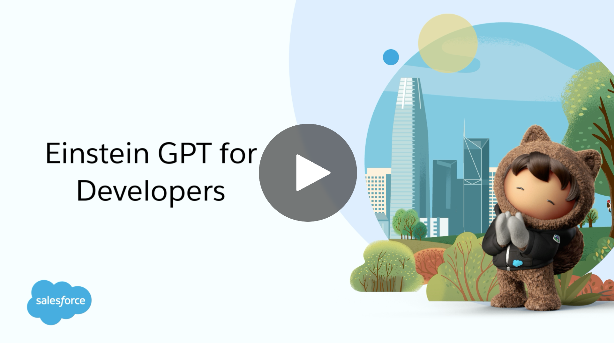

# Einstein GPT For Developers

| | This repository is for Einstein GPT for Developers Pilot Program participants only. This repo will be the primary means of *direct* communication between program participants and the team behind the Einstein GPT for Developers Pilot! We'll be monitoring both the Issues and Discussions tabs for questions, feedback requests & more. Head over to the [User Guide](https://github.com/forcedotcom/Einstein-GPT-for-Developers/wiki) to get started. Happy Pilot-ing! |
|---|---|

## Overview

Einstein GPT for Developers is an AI powered developer tool that is available as an easy-to-install VS Code extension built using CodeGen, Salesforce’s secure, custom AI model. Our goal is to improve developer productivity through AI-based code generation. At this point of time, the Einstein GPT for Devs extension can:

- Generate code from natural language instructions within an existing Apex class, trigger, or anonymous Apex file. Simply enter in a prompt describing what you'd like to build and see Apex code generated within your editor.

 

At this time, the tool does not:
- Create new Apex classes and scaffolded methods without an existing file.
- Take into account any metadata (or context) from your local project or Salesforce org. Generated code is determined by your prompt only.
  
### Setup and Installation

**See the [Einstein GPT for Developers User Guide](https://github.com/forcedotcom/Einstein-GPT-for-Developers/wiki) to get started.** Check out the video below for an overview of the product and getting started process! 

 

### Your Feedback Is Important to Us

Please file an [issue](https://github.com/forcedotcom/Einstein-GPT-for-Developers/issues) in the GitHub repo if you need support during the pilot. Our team will triage all incoming issues during the pilot and get back to you as fast as we can.

Use the [Discussions](https://github.com/forcedotcom/Einstein-GPT-for-Developers/discussions) tab to ask questions, request features, and give us feedback. The primary purpose of any Pilot program is to gather feedback; and we'd love to hear from you! 

We also encourage you to give us feedback on the _generated code_ using 👍, 👎 and comments inside the app. 

 

