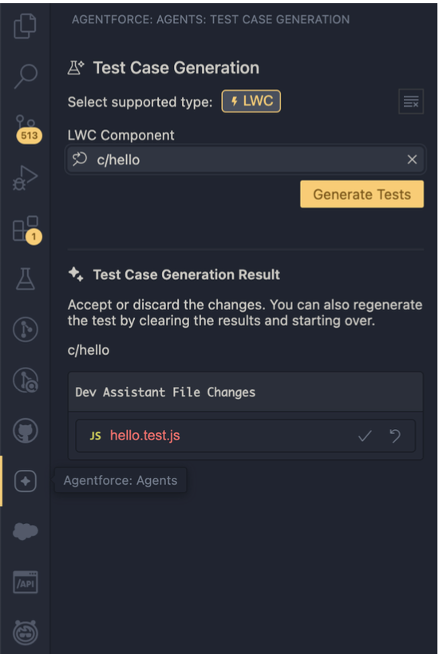
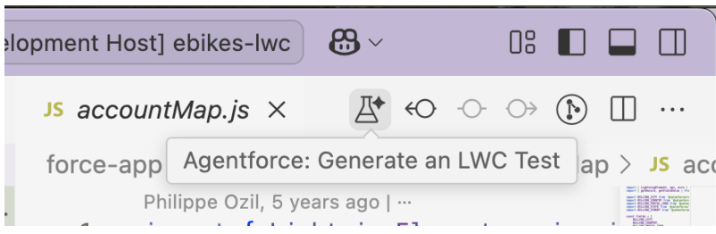
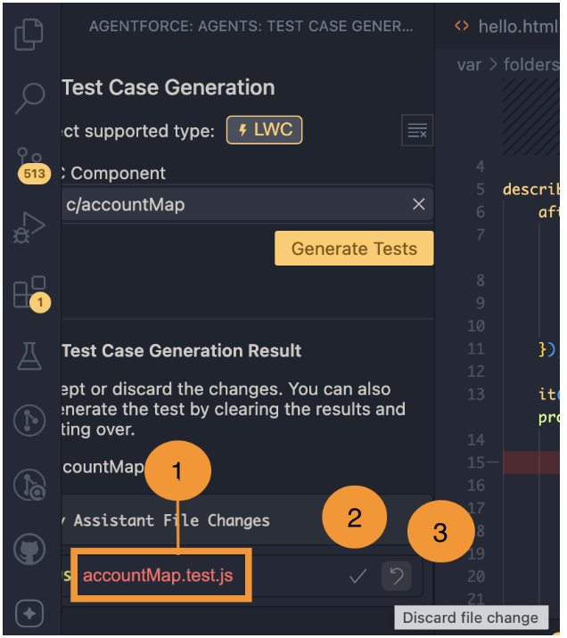

# Test Case Generation for LWC (Developer Preview)

> **Important**: Test case generation for LWC is available as a developer preview. This feature isn't generally available unless or until Salesforce announces its general availability in documentation or in press releases or public statements. All commands, parameters, and other features are subject to change or deprecation at any time, with or without notice. Don't implement functionality developed with these commands or tools.

## Overview
Use the test case generation feature to generate Jest unit tests for your LWC components. This feature introduces new capabilities in the Agentforce for Developers extension.

## Prerequisites
You'll need Agentforce for Developers installed to use this feature. Agentforce for Developers is an AI-powered developer tool that's available as an easy-to-install [VS Code](https://marketplace.visualstudio.com/items?itemName=salesforce.salesforcedx-einstein-gpt) extension built using CodeGen and xGen-Code, which are secure, custom AI models from Salesforce. The extension is available in the VS Code and [Open VSX](https://open-vsx.org/extension/salesforce/salesforcedx-einstein-gpt) marketplaces as a part of the [Salesforce Expanded Pack](https://marketplace.visualstudio.com/items?itemName=salesforce.salesforcedx-vscode-expanded), in the VS Code desktop application, and in Code Builder.

## Install or Update the Agentforce for Developers Extension
For this dev preview, we require that you install v1.11.0+ of the Agentforce for Developers extension. If you have installed an older version of Agentforce for Developers, update the extension to v.11.0.+

To install the extension:

1. In the Activity Bar, click the Extensions icon.
2. Search for Agentforce for Developers. Click Install.
3. Run Developer:Reload Window to finish the installation.

## Log into your Salesforce DX Project
Log into your SFDX project and connect to your Salesforce org:

1. Open an SFDX project in your VS Code IDE, or run SFDX: Create Project to create a new one
2. Run SFDX: Authorize an Org to connect to a Salesforce org. For supported org editions, see [Required Editions](https://developer.salesforce.com/docs/platform/einstein-for-devs/guide/einstein-setup.html#required-editions)

## Enable Test Case Generation for LWC
To enable Test Case Generation for LWC in Agentforce for Developers:

Add this to the `.vscode/settings.json` file in your project:

```json
{
    "salesforce.einsteinForDevelopers.advanced": {
        "improvedTesting": true
    },
    "salesforce.einsteinForDevelopers.enableDebugLogging": true
}
```

To complete the setup, go to the Command Palette and run Developer: Reload Window.

## Generate LWC Jest Tests
If your project doesn't contain any Jest tests, you must first install [Jest](https://developer.salesforce.com/docs/platform/lwc/guide/unit-testing-using-jest-installation.html).

To generate an LWC Jest test:

1. Click the Agentforce: Agents icon in the activity bar to open the Test Case Generation view. Alternatively, from the command palette, run the Agentforce: Generate an LWC Test command



2. Select "LWC" as the supported type
3. Select the component that you want to test. Currently, you cannot select specific methods or files
4. Click Generate Tests to generate Jest tests for the selected component
5. [Review the generated Jest tests](https://docs.google.com/document/d/10pqPKSfiTSRbSUWCzVPN3i3wUEwWKjEg_BZClN4Djm0/edit?tab=t.0#heading=h.devhcz2tkl8a)

Alternatively, you can first open an HTML or JavaScript file for a Lightning web component. To generate an LWC test, click the beaker icon on the Editor Toolbar in the top-right corner of your editor and follow the on-screen instructions. If the Editor Toolbar is missing, go to View > Appearance > Editor Actions Position, and select Tab Bar.



## Review Generated Jest Tests
Generated Jest tests are added to a test file in the component's `__tests__` folder with the filename `<ComponentName>.test.js`, where ComponentName is the name of the Lightning web component you're generating the Jest tests for. If the test file already exists, Jest test generation attempts to improve the test file if there is scope for improvement. You can review the proposed changes in the diff view.

To review the proposed changes:

1. Click the name of the generated file. The diff view appears
2. To accept the changes, click the ✔️ icon. Accepting the changes automatically overwrites the existing test file
3. To discard the file changes and start over, click the ↶ icon



When generating Jest tests, consider these guidelines.

* If your test file already includes at least a test case, new ones may be generated after the last test case.
* If your test case contains a "TODO" description, a test case based on the description you provide is generated. For example, if your test file contains it('TODO: verify that the component renders account name and details when provided', () => {..}, you may see separate test cases for "renders account name when provided" and "renders account details when provided".
* Test case generation may occasionally return a message that no improvements are needed in the tests or it may not return any changes at all. Try including TODO descriptions in your test file and running the test case generation again.

For examples of Jest tests, you can either use your own components (preferred) or refer to ‌these repos and look for test files in the __tests__ folder of a Lightning web component.

1. [dreamhouse-lwc](https://github.com/trailheadapps/dreamhouse-lwc)
1. [ebikes-lwc](https://github.com/trailheadapps/ebikes-lwc)
1. [Lwc-recipes](https://github.com/trailheadapps/lwc-recipes/blob/main/force-app/)


## Example: Generate Jest Tests for a Component
This example shows the [accountMap](https://github.com/trailheadapps/ebikes-lwc/tree/main/force-app/main/default/lwc/accountMap) component from the [ebikes-lwc](https://github.com/trailheadapps/ebikes-lwc) repository. The HTML file displays a map using the lightning-map base component. If viewed on an account record with a billing address, the component displays the map with a marker for that address. If the account record doesn't have an address, it displays a message "No address to map" in the UI. If an error is returned, the message displays "Error retrieving map data".

```html
<template>
    <lightning-card title="accountMap" icon-name="standard:contact">
        <lightning-button label="New" slot="actions"></lightning-button>
        <div class="slds-var-m-around_medium">
            <template lwc:if={markers.length}>
                <lightning-map
                    map-markers={markers}
                    zoom-level={zoomLevel}>
                </lightning-map>
            </template>
            <template lwc:else>
                <c-error-panel friendly-message="No address to map"></c-error-panel>
            </template>
            <template lwc:if={error}>
                <c-error-panel
                    friendly-message="Error retrieving map data"
                    errors={error}>
                </c-error-panel>
            </template>
        </div>
    </lightning-card>
</template>
```

> **Note**: For the purpose of this example, you can remove any existing ```accountMap.test.js``` file and generate a new LWC Jest test. Your generated tests may differ from the ones in this example.

In this example, the LWC JavaScript file for the Jest test generation retrieves the billing city, country, and state of the account record using the ```getRecord``` wire adapter. The ```lightning-map``` component renders the markers based on the record data provisioned by the wire service.

```javascript
import { LightningElement, api, wire } from 'lwc';
import { getRecord, getFieldValue } from 'lightning/uiRecordApi';
import BILLING_CITY from '@salesforce/schema/Account.BillingCity';
import BILLING_COUNTRY from '@salesforce/schema/Account.BillingCountry';
import BILLING_STATE from '@salesforce/schema/Account.BillingState';

const fields = [
    BILLING_CITY,
    BILLING_COUNTRY,
    BILLING_STATE,
];

export default class AccountMap extends LightningElement {
    actions = [
        { label: 'Edit', value: 'edit', iconName: 'utility:edit' },
        { label: 'Delete', value: 'delete', iconName: 'utility:delete' },
    ];
    @api recordId;
    zoomLevel = 14;
    markers = [];
    error;

    @wire(getRecord, { recordId: '$recordId', fields })
    wiredRecord({ error, data }) {
        if (data) {
            this.markers = [];
            this.error = undefined;
            const city = getFieldValue(data, BILLING_CITY);
            if (city) {
                this.markers = [
                    {
                        location: {
                            City: city,
                            Country: getFieldValue(data, BILLING_COUNTRY),
                            State: getFieldValue(data, BILLING_STATE),
                        }
                    }
                ];
            }
        } else if (error) {
            this.markers = [];
            this.error = error;
        }
    }
}
```

### Jest Tests Generation Example
Here's an example of a Jest test file that's returned after running test case generation on the component.

```javascript
import { createElement } from 'lwc';
import AccountMap from '../accountMap';
import { getRecord } from 'lightning/uiRecordApi';

describe('c-account-map', () => {
    afterEach(() => {
        // The jsdom instance is shared across test cases in a single file so reset the DOM
        while (document.body.firstChild) {
            document.body.removeChild(document.body.firstChild);
        }
    });

    it('test case 1: Verify that the component renders correctly when there is no recordId provided', () => {
        // Arrange
        const element = createElement('c-account-map', {
            is: AccountMap
        });
        document.body.appendChild(element);

        // Act
        element.recordId = undefined; // No recordId

        // Assert
        return Promise.resolve().then(() => {
            const mapElement = element.shadowRoot.querySelector('lightning-map');
            expect(mapElement).toBeNull(); // No map should be rendered
        });
    });

    // Additional test cases...
});
```

Four test cases are generated in this example:

1. Verify that the component renders correctly when there is no recordId provided
2. Verify that the component renders an error message when there is an error retrieving data
3. Verify that the component dispatches a custom event when a marker is clicked
4. Verify that data is correctly retrieved from wire

When you try to run the tests, your test cases may fail. You might have to make several changes to fix the test cases. See [Known Issues](https://docs.google.com/document/d/10pqPKSfiTSRbSUWCzVPN3i3wUEwWKjEg_BZClN4Djm0/edit?tab=t.0#heading=h.4zoef1j56wsa).

> **Note**: As part of an initial developer preview release, we are still actively working on reducing the need for manual post-fixes. For this developer preview, LWC Test Case Generation can help speed up your test workflows but may contain some limitations.

### Verify that the component renders correctly when a recordId is provided

The generated test case passes as the ```lightning-map``` component isn't rendered when the recordId is undefined.

### Verify that the component renders an error message when there is an error retrieving data

This test case fails because the returned error message doesn't match the expected error message in the HTML file. To fix the test, update the error message to match the one that's returned when no address is found on the record.
```javascript
expect(errorPanel.friendlyMessage).toBe('No address to map');
```

### Verify that the component dispatches a custom event when a marker is clicked

This test case fails because it doesn't wait for asynchronous DOM updates before querying for the ```lightning-map``` component. To wait for asynchronous DOM updates before querying, move the ```querySelector``` and ```dispatchEvent``` calls into the ```Promise``` block.

```javascript
return Promise.resolve().then(() => {
    const mapElement = element.shadowRoot.querySelector('lightning-map');
    mapElement.addEventListener('markerclick', handler);
    mapElement.dispatchEvent(new CustomEvent('markerclick', {
      detail: { selectedMarkerValue: element.markers }
    }));
    expect(handler).toHaveBeenCalled();
});
```

### Verify that the data is correctly retrieved from the wire

This test case passes because the ```mapMarkers``` property has a length of 1 based on the given ```mockData``` object.


## Known Issues
To enhance the accuracy of your test cases, we recommend running Jest test generation several times. After the initial generation, review and accept the suggested changes. Then, run the test generation again and accept the new changes. This iterative process helps refine and improve the quality of your test cases.

Other known issues for LWC test case generation include:

* Test case generation replaces record IDs with an asterisk. To run your tests successfully, replace the asterisk with a valid ID
* Test case generation masks org IDs to prevent exposure of org IDs in the output. To run your tests successfully, replace the masked value with a valid ID
* Mock data may be generated for test cases that retrieve record data, such as from the ```getRecord``` wire adapter. Mock data generation isn't guaranteed. To use your own mock data, see [Mock the Data](https://developer.salesforce.com/docs/platform/lwc/guide/unit-testing-using-wire-utility.html#mock-the-data) in the LWC Dev Guide
* Check the generated test cases for accuracy. Test cases may fail and require developer input. For example, a test case may fail because of an incorrect import or a reference to mock data that doesn't exist

In some cases, test case generation may not generate new test cases, and instead reformat or refactor existing test cases. You can reject the proposed changes and run test case generation again. We recommend that you report this issue when you encounter it as your feedback is important in helping us improve LWC test case generation.

To review all known issues related to Agentforce for Developers, check our GitHub [repo](https://github.com/forcedotcom/Einstein-GPT-for-Developers/issues). At the time of writing, the Agentforce for Developers repo may not contain issues related to LWC test case generation. The repo will be updated as we roll out the feature to a wider audience.

## Thank You for Your Feedback

Your feedback during the developer preview helps shape the future of our products. You can use Github issues to provide your feedback. Before you submit an issue, review the Known Issues.